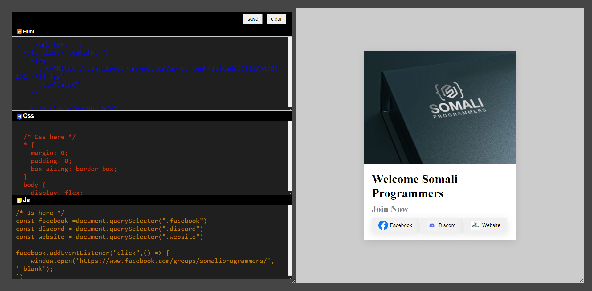

# IEditor: A Web Code Editor

This is a README for a web-based code editor named IEditor. It allows you to write and edit HTML, CSS, and JavaScript code and see the live preview of your changes.

## Features:

- Edit HTML, CSS, and JavaScript code in separate sections.
- Live preview of the code changes in an iframe.
- Save and clear functionality to manage your code.
- Syntax highlighting for different code languages (HTML, CSS, JS).

## Code Structure:

The code consists of three main parts:

- **HTML:** This defines the structure of the editor interface.
- **CSS:** This styles the editor interface, including colors, fonts, and layout.
- **JavaScript:** This provides the interactivity and functionality of the editor.

## How it Works:

1. When the page loads, the `init` function sets the initial content for HTML, CSS, and JavaScript sections. It also checks for previously saved code in localStorage and loads it if available.
2. As you type in any of the code sections (HTML, CSS, or JS), the `run` function is triggered, which updates the preview iframe with the combined HTML and styled content along with any JavaScript code you've written.
3. Clicking the "Save" button calls the `saveCodeToLocalStorage` function, which stores the current code from each section in localStorage.
4. Clicking the "Clear" button calls the `removeCodeToLocalStorage` function to remove any saved code from localStorage and reloads the page.

## Additional Notes:

- The code utilizes localStorage to save and load code snippets between sessions.
- The `eval` function is used in the `run` function to execute JavaScript code within the preview iframe. Be cautious when using `eval` as it can be a security risk if untrusted code is being executed.
