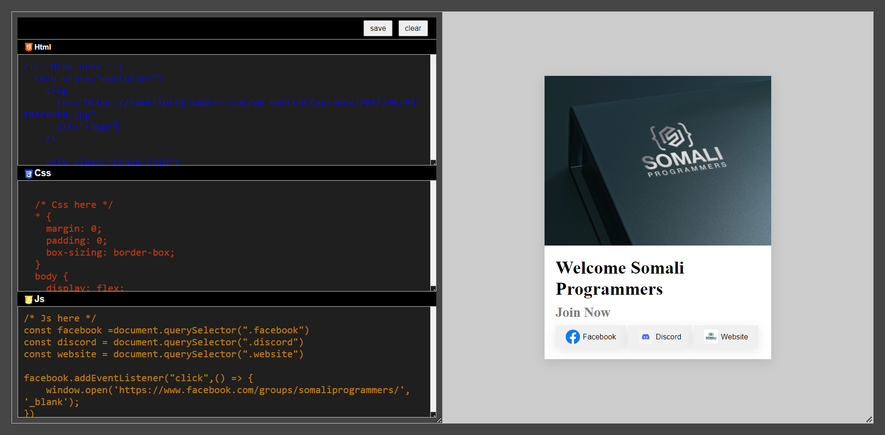

# IEditor — Web Code Editor



A lightweight, browser-based code editor for writing and previewing **HTML**, **CSS**, and **JavaScript** in real time. No installation, no build tools — just open in a browser and start coding.

🔗 **Live Demo:** [https://caytomahamed.github.io/IEditor/](https://caytomahamed.github.io/IEditor/)

---

## Table of Contents

- [Features](#features)
- [Getting Started](#getting-started)
- [Usage](#usage)
- [Project Structure](#project-structure)
- [How It Works](#how-it-works)
- [JavaScript API Reference](#javascript-api-reference)
- [Security Notes](#security-notes)
- [Browser Compatibility](#browser-compatibility)
- [Contributing](#contributing)
- [License](#license)

---

## Features

- **Split-pane editor** — three separate text areas for HTML, CSS, and JavaScript.
- **Live preview** — the output iframe updates automatically as you type.
- **Syntax color-coding** — HTML text is shown in blue, CSS in orange, JavaScript in gold.
- **Persistent storage** — your code is saved to `localStorage` so it survives page refreshes and browser restarts.
- **Save & Clear controls** — save your work or reset back to the built-in example with a single click.
- **Zero dependencies** — plain HTML, CSS, and JavaScript; works entirely in the browser.

---

## Getting Started

Because IEditor is a static web application with no build step and no server-side code, setup is as simple as:

1. **Clone the repository**

   ```bash
   git clone https://github.com/Caytomahamed/IEditor.git
   ```

2. **Open `index.html` in your browser**

   ```bash
   cd IEditor
   open index.html        # macOS
   start index.html       # Windows
   xdg-open index.html    # Linux
   ```

   Or drag `index.html` into any browser window.

That's it — no `npm install`, no build command, no server required.

---

## Usage

### Writing Code

The editor panel (left side) contains three labeled text areas:

| Label | Language | Text Color |
|-------|----------|------------|
| **HTML** | HTML markup | Blue |
| **CSS** | CSS styles | Orange |
| **JS** | JavaScript | Gold |

Type your code into any of these areas. The **preview pane** (right side) refreshes automatically after every keystroke.

### Saving Your Work

Click the **Save** button in the toolbar to persist your current code to `localStorage`. A confirmation alert appears after one second. Your code will reload automatically the next time you open the page.

### Clearing & Resetting

Click the **Clear** button to wipe the saved code from `localStorage` and reload the page. The editor will return to the built-in example (a "Somali Programmers" community card).

---

## Project Structure

```
IEditor/
├── index.html     # Application shell — editor layout & iframe
├── index.css      # All editor styles (layout, colors, scrollbars)
├── index.js       # Core logic (init, run, save, clear)
├── IEditor.png    # Screenshot used in this README
├── editor.png     # Browser tab favicon
├── html5.webp     # HTML section icon
├── css.png        # CSS section icon
└── js.png         # JavaScript section icon
```

All application logic is contained in three files — `index.html`, `index.css`, and `index.js`.

---

## How It Works

### Initialization (`init`)

On the very first visit (when `localStorage` is empty), the `init` function populates all three editors with a built-in "Somali Programmers" example. The example is then saved to `localStorage` and the page reloads so the saved values are loaded consistently on every subsequent visit.

### Live Preview (`run`)

Every `keyup` event on any editor textarea calls `run`. This function:

1. Reads the current value of the HTML editor.
2. Wraps the current CSS editor value in a `<style>` tag and appends it to the HTML string.
3. Writes the combined markup into the preview `<iframe>` via `document.open()` / `document.write()` / `document.close()`.
4. Executes the JavaScript editor content inside the iframe using `iframe.contentWindow.eval()`.

### Persistence (`saveCodeToLocalStorage` / `removeCodeToLocalStorage`)

| Action | Effect |
|--------|--------|
| **Save** | Calls `localStorage.setItem()` for `savedHtml`, `savedCss`, and `savedJs`. |
| **Clear** | Calls `localStorage.removeItem()` for the same three keys, then reloads the page. |

On every page load, the three keys are read back from `localStorage` and placed directly into the respective `<textarea>` elements.

---

## JavaScript API Reference

All functions are defined in `index.js` in the global scope.

### `init()`

Populates the HTML, CSS, and JavaScript editors with the built-in example content.

```js
init();
```

Called automatically when no saved code is found in `localStorage`.

---

### `run()`

Reads the current code from all three editors and renders the result in the preview iframe.

```js
run();
```

Triggered automatically on every `keyup` event and once on `DOMContentLoaded`.

---

### `saveCodeToLocalStorage()`

Saves the current editor contents to `localStorage`.

```js
saveCodeToLocalStorage();
// Stores: savedHtml, savedCss, savedJs
```

Triggered by a click on the **Save** button.

---

### `removeCodeToLocalStorage()`

Removes all saved editor content from `localStorage`.

```js
removeCodeToLocalStorage();
// Removes: savedHtml, savedCss, savedJs
```

Triggered by a click on the **Clear** button, followed by a page reload.

---

## Security Notes

- The JavaScript entered in the **Js** editor is executed with `iframe.contentWindow.eval()`. This is intentional — the editor is designed to run arbitrary user-supplied code.
- **Do not** deploy IEditor in an environment where untrusted third parties can inject JavaScript, as `eval()` can execute any code including code that reads cookies or makes network requests.
- IEditor is intended for **personal use, learning, and experimentation**. Treat it like a local sandbox.

---

## Browser Compatibility

IEditor uses standard web APIs that are supported in all modern browsers:

| Browser | Supported |
|---------|-----------|
| Chrome / Edge | ✅ |
| Firefox | ✅ |
| Safari | ✅ |
| Opera | ✅ |

Internet Explorer is **not** supported.

---

## Contributing

Contributions are welcome! To get started:

1. Fork the repository.
2. Create a feature branch: `git checkout -b feature/my-improvement`
3. Commit your changes: `git commit -m "Add my improvement"`
4. Push to your branch: `git push origin feature/my-improvement`
5. Open a Pull Request.

Please keep changes focused and include a clear description of what you changed and why.

---

## License

This project is open-source and available under the [MIT License](https://opensource.org/licenses/MIT).
